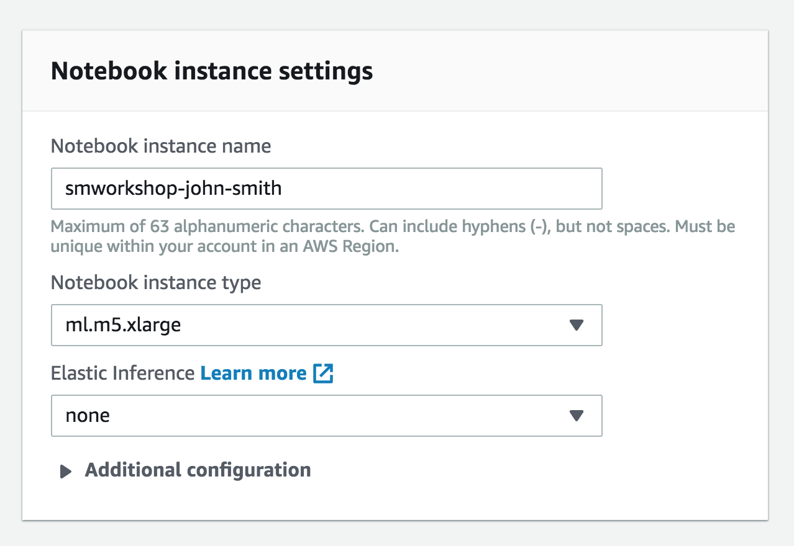
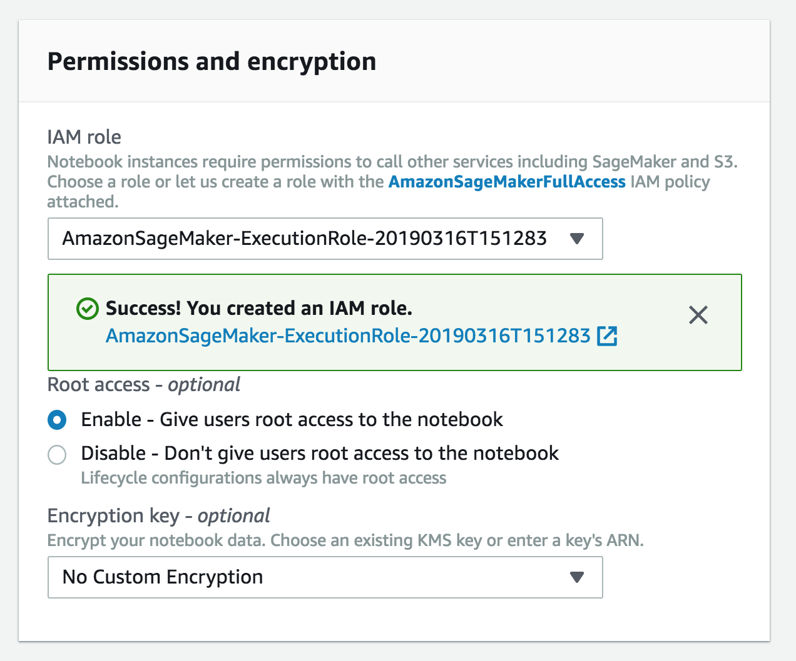
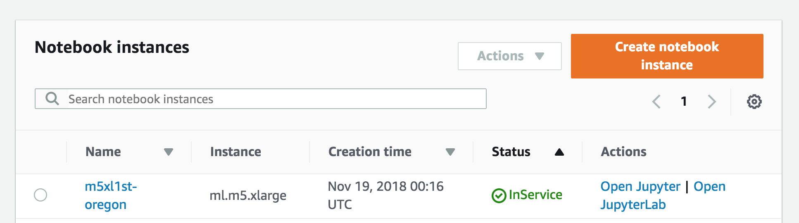

# sagemakerworkshop


# Creating a Notebook Instance

We'll start by creating an Amazon S3 bucket that will be used throughout the workshop.  We'll then create a SageMaker notebook instance, which we will use for the other workshop modules.

## 1. Create a S3 Bucket

SageMaker typically uses S3 as storage for data and model artifacts.  In this step you'll create a S3 bucket for this purpose. To begin, sign into the AWS Management Console, https://console.aws.amazon.com/.

### High-Level Instructions

Use the console or AWS CLI to create an Amazon S3 bucket (see step-by-step instructions below if you are unfamiliar with this process). Keep in mind that your bucket's name must be globally unique across all regions and customers. We recommend using a name like `smworkshop-firstname-lastname`. If you get an error that your bucket name already exists, try adding additional numbers or characters until you find an unused name.

<details>
<summary><strong>Step-by-step instructions (expand for details)</strong></summary><p>

1. In the AWS Management Console, choose **Services** then select **S3** under Storage.

1. Choose **+Create Bucket**

1. Provide a globally unique name for your bucket such as `smworkshop-firstname-lastname`.

1. Select the Region you've chosen to use for this workshop from the dropdown.

1. Choose **Create** in the lower left of the dialog without selecting a bucket to copy settings from.

</p></details>

## 2. Launching the Notebook Instance

1. Make sure you are on the AWS Management Console home page.  In the **Find Services** search box, type **SageMaker**.  The search result list will populate with Amazon SageMaker, which you should now click.  This will bring you to the Amazon SageMaker console homepage.


2. In the upper-right corner of the AWS Management Console, confirm you are in the desired AWS region. Select N. Virginia, Oregon, Ohio, or Ireland.

3. To create a new notebook instance, click the **Notebook instances** link on the left side, and click the **Create notebook instance** button in the upper right corner of the browser window.


4. Type smworkshop-[First Name]-[Last Name] into the **Notebook instance name** text box, and select ml.m5.xlarge for the **Notebook instance type**.



5. In the **Permissions and encryption** section, choose **Create a new role** in the **IAM role** drop down menu.  In the resulting pop-up modal, select **Specific S3 buckets** under **S3 Buckets you specify – optional**. In the text field, paste the name of the S3 bucket you created above, AND the following bucket name separated from the first by a comma:  `gdelt-open-data`.  The combined field entry should look similar to ```smworkshop-john-smith, gdelt-open-data```. Click **Create role**.


6. You will be taken back to the Create Notebook instance page.  Now you should see a message saying "Success! You created an IAM role."



7. Click **Create notebook instance** at the bottom.

### 3. Accessing the Notebook Instance

1. Wait for the server status to change to **InService**. This will take several minutes, possibly up to ten but likely much less.



2. Click **Open Jupyter**. You will now see the Jupyter homepage for your notebook instance.


## Image Classification 


For this module, we'll work with an image classification example notebook. In particular, we'll use Amazon SageMaker's built-in image classification algorithm, which is a supervised learning algorithm that takes an image as input and classifies it into one of multiple output categories. 

It uses a convolutional neural network (ResNet) that can be trained from scratch, or trained using transfer learning.  The technique of transfer learning is useful when a large number of training images are not available. Even if you don't have experience with neural networks or image classification, SageMaker's image classification algorithm makes the technology easy to use, with no need to design and set up your own neural network.  

Follow these steps:

1. Be sure you have downloaded this GitHub repository .  Next, in your notebook instance, click the **New** button on the right and select **Folder**.  

2. Click the checkbox next to your new folder, click the **Rename** button above in the menu bar, and give the folder a name such as 'image-classification'.

3. Click the folder to enter it.

4. To upload the notebook, click the **Upload** button on the right. Then in the file selection popup, select the file 'Image-classification-transfer-learning.ipynb' from the notebooks subdirectory in the folder on your computer where you downloaded this GitHub repository. Click the blue **Upload** button that appears to the right of the notebook's file name.

5. You are now ready to begin the notebook:  click the notebook's file name to open it, then follow the directions in the notebook.


<p><strong>NOTE:  training the model for this example typically takes about 10 minutes.</strong> However, keep in mind that this is relatively short because transfer learning is used rather than training from scratch, which could take many hours.</p>


